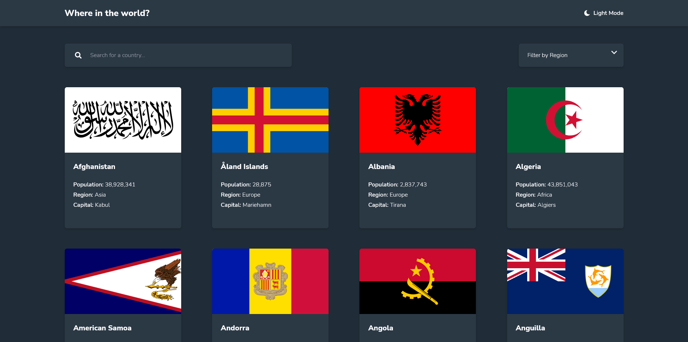
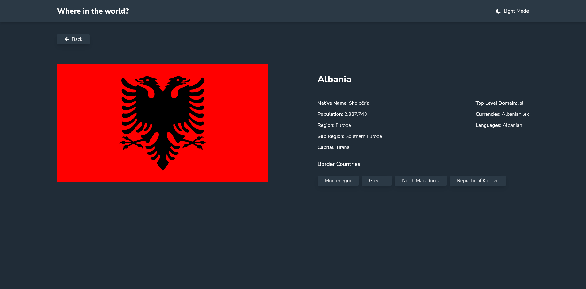

# Frontend Mentor - REST Countries API with color theme switcher solution

This is a solution to the [REST Countries API with color theme switcher challenge on Frontend Mentor](https://www.frontendmentor.io/challenges/rest-countries-api-with-color-theme-switcher-5cacc469fec04111f7b848ca). Frontend Mentor challenges help you improve your coding skills by building realistic projects.

## Table of contents

- [Overview](#overview)
    - [The challenge](#the-challenge)
    - [Screenshot](#screenshot)
    - [Links](#links)
- [My process](#my-process)
    - [Built with](#built-with)
- [Author](#author)

## Overview

### The challenge

Users should be able to:

- See all countries from the API on the homepage
- Search for a country using an `input` field
- Filter countries by region
- Click on a country to see more detailed information on a separate page
- Click through to the border countries on the detail page
- Toggle the color scheme between light and dark mode *(optional)*

### Screenshot

### Links

- Solution URL: [Solution URL](https://www.frontendmentor.io/solutions/rest-countries-api-with-tailwind-nextjs-and-typescript-wG5sqEKDT)
- Live Site URL: [Live site URL](https://rest-countries-with-color-theme.vercel.app/)

## My process

### Built with

- Semantic HTML5 markup
- Flexbox
- Mobile-first workflow
- [React](https://reactjs.org/) - JS library
- [Next.js](https://nextjs.org/) - React framework
- [TypeScript](https://www.typescriptlang.org/) - For types
- [Tailwindcss](https://tailwindcss.com/) - For styles

## Author

- Website - [Bartosz Fórmanowski](https://www.bartoszformanowski.me)
- Frontend Mentor - [@BartekFo](https://www.frontendmentor.io/profile/BartekFo)
- Twitter - [@Bartosz_For](https://twitter.com/Bartosz_For)

